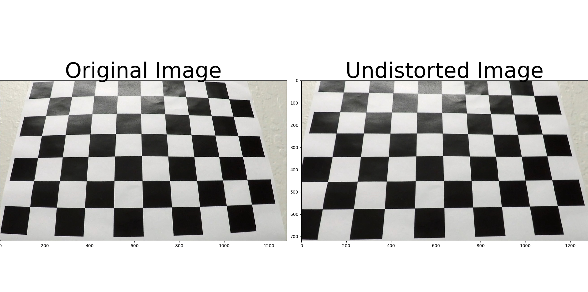
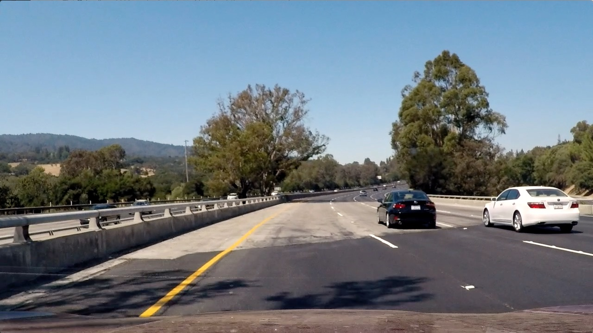
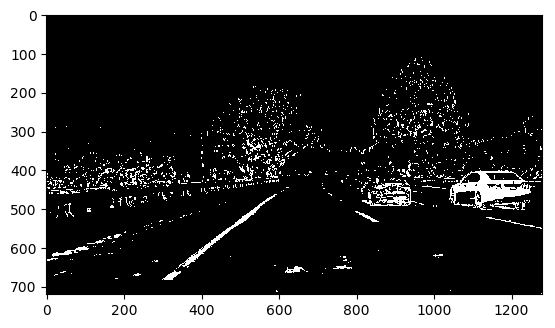
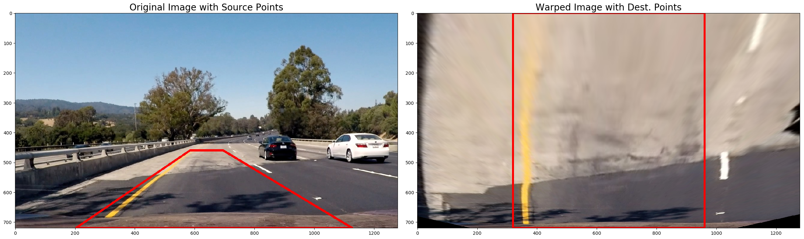
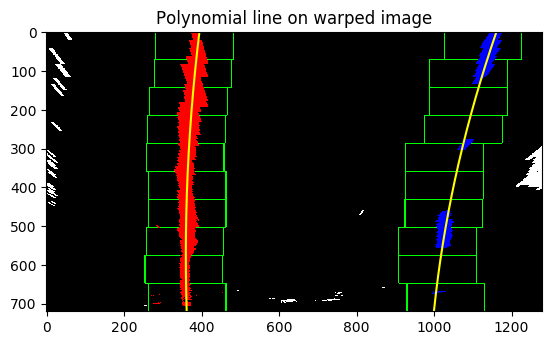
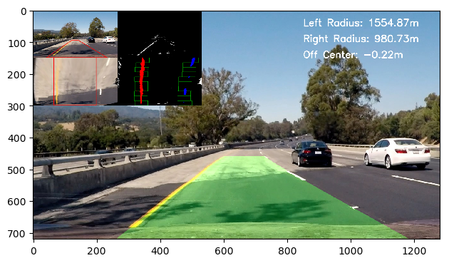

## Advanced Lane Finding Project

The goals / steps of this project are the following:

* Compute the camera calibration matrix and distortion coefficients given a set of chessboard images.
* Apply a distortion correction to raw images.
* Use color transforms, gradients, etc., to create a thresholded binary image.
* Apply a perspective transform to rectify binary image ("birds-eye view").
* Detect lane pixels and fit to find the lane boundary.
* Determine the curvature of the lane and vehicle position with respect to center.
* Warp the detected lane boundaries back onto the original image.
* Output visual display of the lane boundaries and numerical estimation of lane curvature and vehicle position.

## [Rubric](https://review.udacity.com/#!/rubrics/571/view) Points

### Here I will consider the rubric points individually and describe how I addressed each point in my implementation.  

---

### Writeup / README

### Camera Calibration

The code for this step is contained in `calibrate()`. OpenCV provides a nice function that calibrates a camera given a chessboard corners. All we define is the number of rows and columns for the chessboard corners. Using the provided OpenCV calibration function, we get the distortion correction matrix. I applied this distortion correction to the test image using the `cv2.undistort()` function and obtained this result: 


### Pipeline

My image processing pipeline follows the pattern:

Undistort

Binarize using RGB/HLS channels and x gradient

Mask Region of interest

Perspective Transform

Polynomial Fit using histogram

Un-transform

Draw Lane

Annotate Text

Combine

#### 1. Provide an example of a distortion-corrected image.

To demonstrate this step, I will describe how I apply the distortion correction to one of the test images like this one:


#### 2. Describe how (and identify where in your code) you used color transforms, gradients or other methods to create a thresholded binary image.  Provide an example of a binary image result.

Based on forum discussions, x gradient didn't seem so popular as it was noisy. After the first review of my project, I discarded the x gradient. I used R and G channel and combined that with S and G channel.



#### 3. Describe how (and identify where in your code) you performed a perspective transform and provide an example of a transformed image.

Perspective transform was done as part of the pipeline. I hardcoded `src` and `dst` points from the writeup. I calculate the perspective transform matrix using the following points and code:

| Source        | Destination   | 
|:-------------:|:-------------:| 
| 585, 460      | 320, 0        | 
| 203, 720      | 320, 720      |
| 1127, 720     | 960, 720      |
| 695, 460      | 960, 0        |

```python
M = cv2.getPerspectiveTransform(src, dst)
Minv = cv2.getPerspectiveTransform(dst, src)
```

I verified that my perspective transform was working as expected by drawing the `src` and `dst` points onto a test image and its warped counterpart to verify that the lines appear parallel in the warped image.



#### 4. Describe how (and identify where in your code) you identified lane-line pixels and fit their positions with a polynomial?

Using histogram on warped image, I identify windows of most pixels where I think the lane is. The distribution is bimodal as we expect, since we should see left and right lane. After isolating the points, I fit a polynomial line through those points.



#### 5. Describe how (and identify where in your code) you calculated the radius of curvature of the lane and the position of the vehicle with respect to center.

In `fit_polynomial` function I use the following code given in the lessons:
```python
y_eval = np.max(ploty)
# Define conversions in x and y from pixels space to meters
ym_per_pix = 30 / 720  # meters per pixel in y dimension
xm_per_pix = 3.7 / 700  # meters per pixel in x dimension

# Fit new polynomials to x,y in world space
left_fit_cr = np.polyfit(ploty * ym_per_pix, left_fitx * xm_per_pix, 2)
right_fit_cr = np.polyfit(ploty * ym_per_pix, right_fitx * xm_per_pix, 2)
# Calculate the new radii of curvature
left_curverad = ((1 + (2 * left_fit_cr[0] * y_eval * ym_per_pix + left_fit_cr[1]) ** 2) ** 1.5) / np.absolute(2 * left_fit_cr[0])
right_curverad = ((1 + (2 * right_fit_cr[0] * y_eval * ym_per_pix + right_fit_cr[1]) ** 2) ** 1.5) / np.absolute(2 * right_fit_cr[0])

# Calculate deviation from the center
camera_position = out_img.shape[1] / 2
center_offset_meters = (camera_position - ((left_fitx[-1] + right_fitx[-1]) / 2)) * xm_per_pix

```

#### 6. Provide an example image of your result plotted back down onto the road such that the lane area is identified clearly.

Using all the images above, I use `compose_final` function in `pipeline.py` to put all the images together to produce the following layout:



---

### Pipeline (video)

Here's a [link to my video result](https://youtu.be/cnGFnBN0R4I)

---

### Discussion

I regret not using the udacity discussion forum much more in the course. I received a lot of help from reading others' questions and answers. The topics that I received help using the forum include choosing which channels to use, src/dst points, region of interest, lane offset, etc. 

Choosing RG | SL, and their thresholds, were a bit of an arbitrary process. I would like to investigate more on what the optimal configuration is for detecting lanes. Same goes for src/dst points.

There's a slight jitter towards the end of the video. I would like to make my pipeline robust for such using smoothing and averaging.

My pipeline currently does not pass the challenge video and harder challenge video because of three reasons: 

1) My thresholds and channel are not robust enough to detect lanes in the shadow.
2) My perspective transform are not robust enough to account for hard curves in the harder challenge video.
3) My region of interest are masking too much of areas that may actually be useful.
